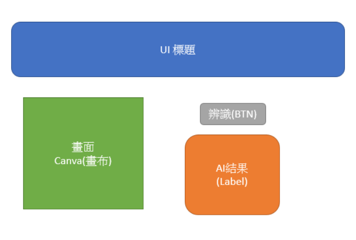
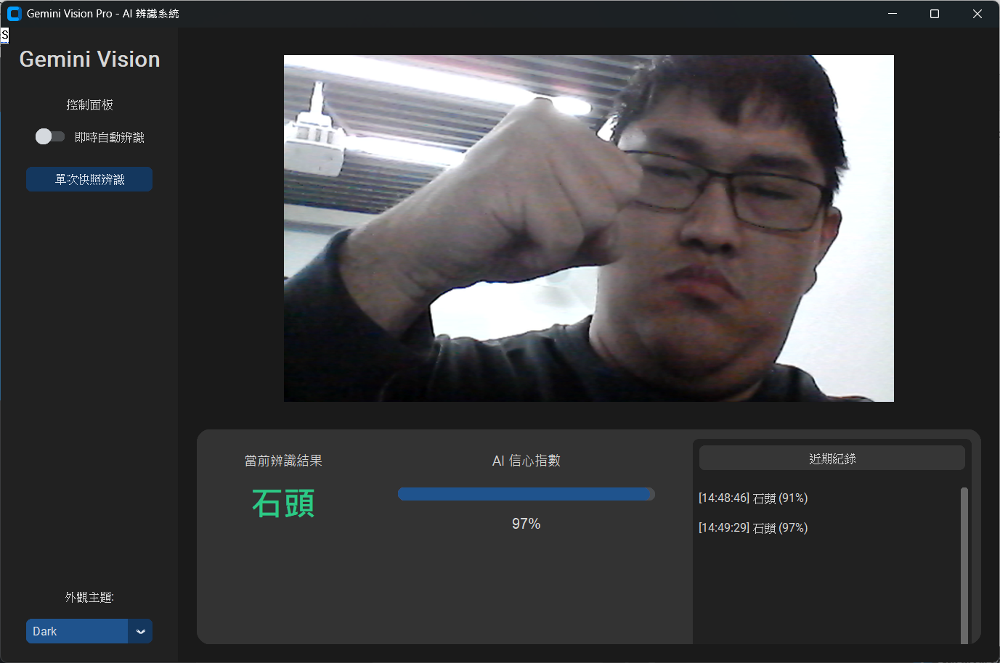
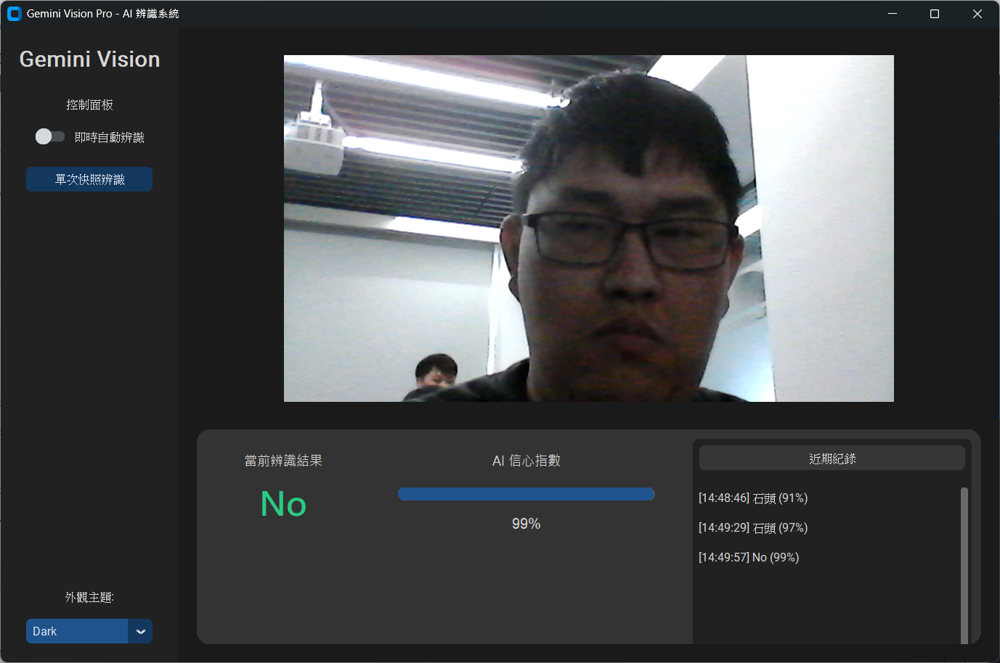
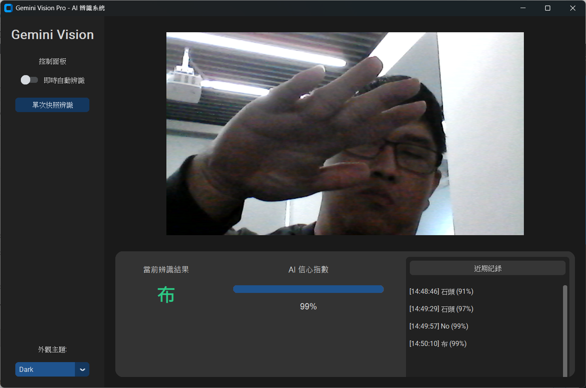

# Gemini Vision Pro - AI 影像辨識系統

本專案是一個整合 Google Teachable Machine 模型與 Python CustomTkinter GUI 的即時影像辨識應用程式。透過電腦視覺技術，系統能夠即時分析攝影機畫面並顯示辨識結果與信心指數。

## 專案特色

*   **現代化 GUI 介面**：使用 `customtkinter` 打造深色模式介面，提供舒適的使用者體驗。
*   **即時辨識**：整合 OpenCV 與 TensorFlow/Keras，實現流暢的即時影像分類。
*   **雙模式操作**：支援「單次快照辨識」與「即時自動辨識」兩種模式。
*   **視覺化儀表板**：提供信心度進度條與歷史紀錄功能，讓辨識結果一目瞭然。
*   **高相容性**：內建針對 TensorFlow 版本差異的相容性修正，確保舊版模型也能順利運行。

## 原始設計概念

專案開發初期的 UI 概念設計圖：



## 程式執行結果

實際執行畫面展示：

### 1. 系統啟動與介面


### 2. 辨識運作展示


### 3. 辨識結果與信心度


## 快速開始

### 環境需求
*   Python 3.9+
*   Windows 11 (建議)

### 安裝依賴
請確保已安裝以下套件：
```bash
pip install opencv-python numpy pillow customtkinter tensorflow tf-keras
```

### 執行程式
啟動 Gemini Vision Pro：
```bash
python gemini_gui.py
```
或者執行基礎版介面：
```bash
python gui_app.py
```