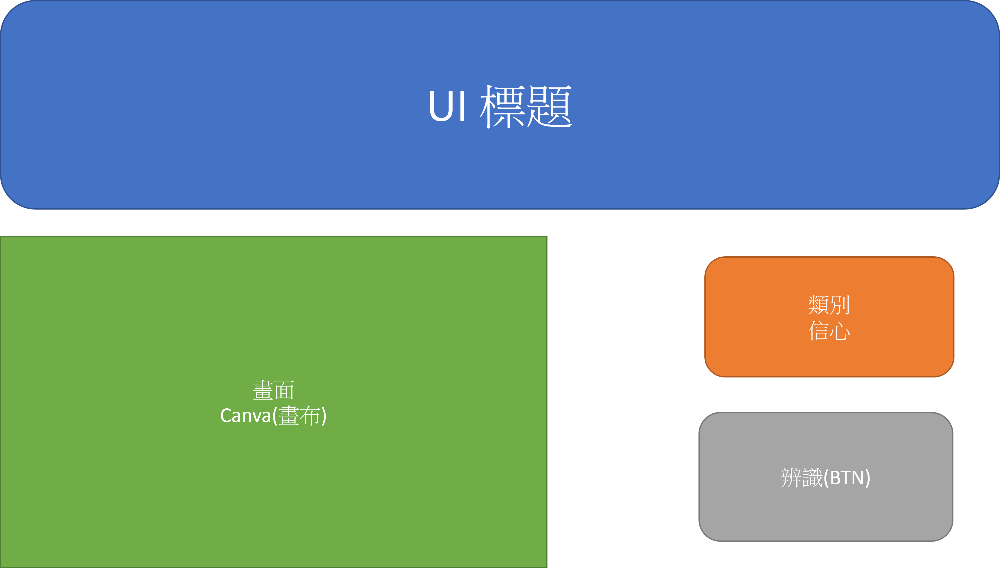
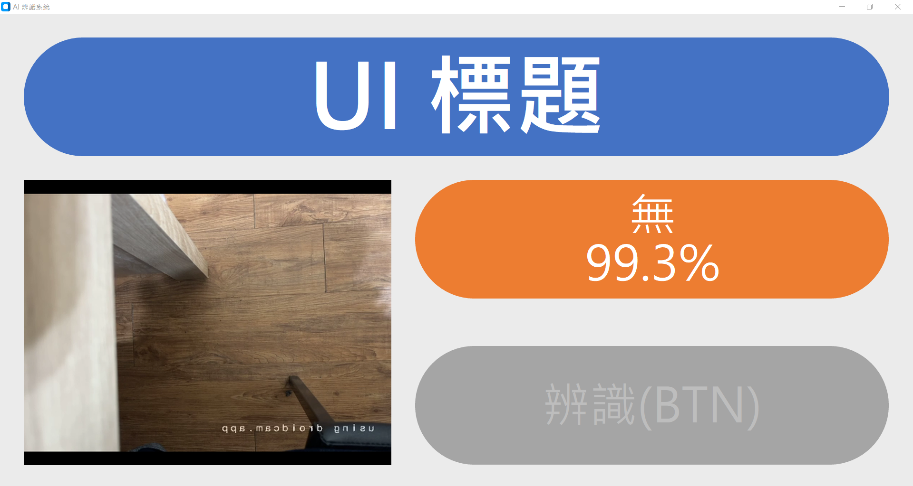
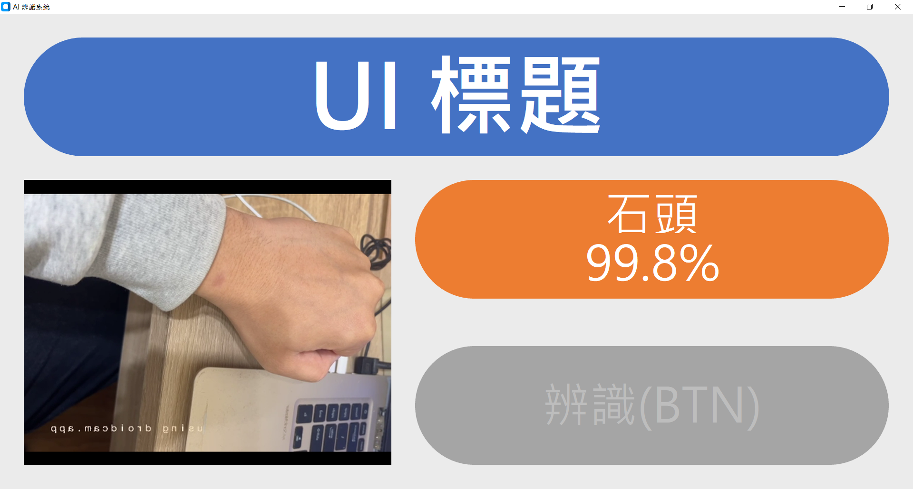

# AI 辨識系統專案說明

本專案是一個整合即時影像擷取與深度學習辨識的桌面應用程式。程式碼位於 `AIProject_KE/app.py`，採用 **CustomTkinter** 構建現代化使用者介面，並使用 **TensorFlow (Keras)** 進行即時影像分類。

## 核心功能

1.  **高解析度 UI 設計**: 
    - 專為高解析度螢幕設計 (3887x2209)，採用大圓角 (Corner Radius) 與高對比配色 (藍/綠/橘/灰)。
    - 包含標題區、攝影機畫面顯示區、辨識結果資訊區。

2.  **即時攝影機串流**:
    - 使用 OpenCV (`cv2`) 擷取攝影機影像。
    - 自動調整影像大小以適應 UI 佈局 (Cover/Contain 模式)。
    - 支援影像鏡像翻轉，提升操作直覺感。

3.  **AI 模型推論**:
    - 載入 Teachable Machine 訓練之 `.h5` 模型 (`keras_model.h5`) 與標籤檔 (`labels.txt`)。
    - 為了相容新版 TensorFlow (2.16+)，特別引入 `tf_keras` 與自定義的 `FixedDepthwiseConv2D` 層來解決舊版模型載入錯誤。
    - 即時計算並顯示預測「類別」與「信心度 (Confidence)」。

4.  **強健性設計**:
    - 自動偵測並處理攝影機連線問題。
    - 包含完整的錯誤處理機制 (Error Logging)，確保模型載入失敗時 UI 仍能運作並顯示錯誤訊息。

## 執行環境與依賴

*   **Python 版本**: 3.11 (建議)
*   **主要函式庫**:
    *   `customtkinter`: UI 介面
    *   `opencv-python`: 影像處理
    *   `tensorflow` / `tf_keras`: 深度學習模型推論
    *   `Pillow`: 影像格式轉換

## 程式截圖與設計稿

以下展示本系統的 UI 設計概念與實際運作效果：

### 1. UI 設計概念稿
程式開發的原始設計參考圖。

### 2. 實際運作 - 無物件狀態
系統啟動後的待機畫面，顯示背景環境。

### 3. 實際運作 - 辨識範例 (布)
成功辨識手勢「布」，信心度顯示為 100.0%。

### 4. 實際運作 - 辨識範例 (石頭)
成功辨識手勢「石頭」，信心度顯示為 99.8%。

